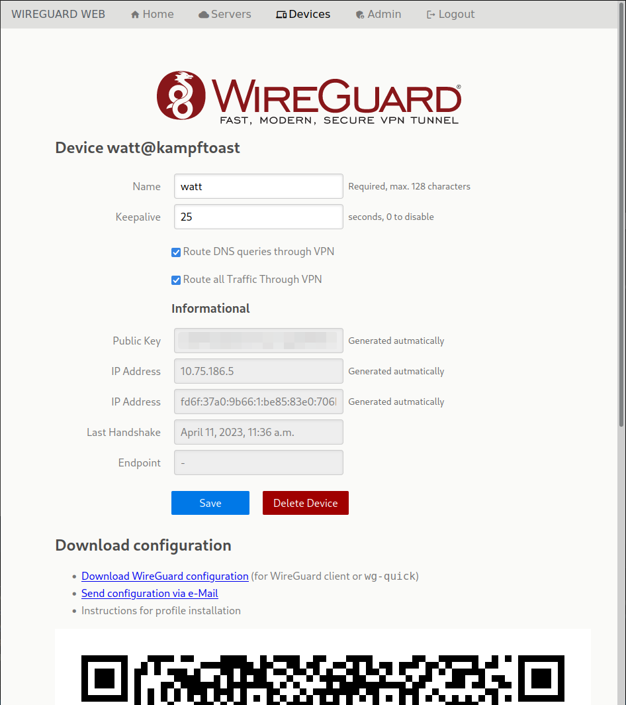

# Wireguard management interface

To make it easier to judge if this tool is for you here's a screenshot of the
device administration interface. See `doc` directory for more screenshots.



For detailed documentation visit the [User documentation](https://dunkelstern.github.io/wireguard-web/index.html)

## Changelog

- `0.6.0`:
  - Switch from `pipenv` to `poetry` for dependency management
  - More robust parsing of systemctl output on Ubuntu
  - Dark mode UI
  - Better UI for mobile devices

## Roadmap

Before releasing 1.0 we want the following to work:

1. Stable network bridging (currently very beta)
2. Server management through native UI, not just Django admin
3. User management through native UI
4. Documentation and Step by step How-tos
5. Refactor form parsing for client editing UI
6. Zero Trust/Peer2Peer VPN support. This means your wireguard client will connect directly to the server if you're in
   the same network and not go through a central concentration point. This means we need the following:
   - Zero Trust Service endpoints need a mechanism to update their peer list dynamically (API + Additional client)
   - Clients that access Zero Trust endpoints need routing priorities to only use the VPN gateway when the service
     endpoint is not reachable from the local net (Probably works just by configuring the corresponding peers in the
     wireguard client)
7. Appliance style Docker container for easier deployment

## Prerequisites

1. Wireguard compiled into Linux kernel (should be the case for any modern distro)
2. Installed wireguard tools (we need the `wg-quick` and `wg` tools here)
3. SystemD (sorry non-systemd users, I don't want to debug any other solutions)
4. Python > 3.9 with `pip` and `virtualenv` support (be aware Debian/Ubuntu users!)
5. `sudo`
6. `dnsmasq` if you want to use the routed DNS functionality

## Setup

1. Unpack release and switch to unpacked directory
2. Create python venv: `python -m venv ~/.virtualenvs/wireguard_web`
3. Activate venv: `source ~/.virtualenvs/wireguard_web`
4. Install dependency manager: `pip install poetry`
5. Install dependencies: `poetry install`
6. Setup your `.env` file, for a sample see `.env.example`
7. Create the database and a first user:

   ```bash
   python manage.py migrate
   python manage.py createsuperuser
   python manage.py create_groups
   ```

8. Install Systemd services: `./setup_wireguard_web.sh`

## `.env` configuration

To configure the application the only file you have to touch is the `.env` file in the source directory (there is a `.env.example` file to base your config on):

```bash
# Base URL on which the service will be run, if you use a reverse proxy to terminate
# TLS use the URL of the proxy and not the internal URL here.
WIREGUARD_WEB_BASE_URL=http://localhost:8000

# Configuration staging directory
WIREGUARD_STAGING_CONFIG_DIRECTORY=/tmp/wireguard-staging

# email configuration
WIREGUARD_WEB_EMAIL_HOST=localhost
WIREGUARD_WEB_EMAIL_PORT=25
WIREGUARD_WEB_EMAIL_USER=
WIREGUARD_WEB_EMAIL_PASSWORD=
WIREGUARD_WEB_EMAIL_TLS=0

# select the email backend
# examples:
#  - django.core.mail.backends.console.EmailBackend -> log to console
#  - django.core.mail.backends.smtp.EmailBackend -> smtp
#  - django.core.mail.backends.dummy.EmailBackend -> do not send mails
WIREGUARD_WEB_EMAIL_BACKEND=django.core.mail.backends.console.EmailBackend

# default from email address
WIREGUARD_WEB_EMAIL_FROM=root@localhost

# enable debug mode with this setting
WIREGUARD_WEB_DEBUG=0
```

## Running

1. Activate the venv: `source ~/.virtualenvs/wireguard_web`
2. Change to the source directory
3. Run the server.

### Development server

To run the development server, just switch to the source directory and run:

```bash
set -o allexport
source .env
set +o allexport
python manage.py runserver
```

This will by default only listen on localhost on port 8000. To deploy this service
please run with gunicorn:

### Gunicorn

To run the service in production mode run the server via `gunicorn`.

1. Make sure gunicorn is installed in the venv, install if it is not: `pip install gunicorn`
2. Load environment: `set -o allexport ; source .env ; set +o allexport`
3. Collect static files: `python manage.py collectstatic`
4. Run gunicorn: `gunicorn -b 0.0.0.0:8000 --workers 2 wireguard_web.wsgi:application`

or alternatively use the startup script: `./wireguard_web_ui.sh`. Make sure the
Python venv is activated before trying.

## sudo pre-requisites

To access the statistics of the wireguard interface the User running this
application needs sudo rights for the following commands:

- `wg show all endpoints`
- `wg show all latest-handshakes`

Example `/etc/suders.d/020-wireguard-web`:

```sudoers
# User rules for the 'wireguard-web' user
wireguard-web ALL=(ALL) NOPASSWD: /usr/bin/wg show all endpoints
wireguard-web ALL=(ALL) NOPASSWD: /usr/bin/wg show all latest-handshakes
```

## Deployment

To be able to deploy configuration from the staging directory the following command
should be run regularly (see systemd scripts in `/systemd`)

- `update_config.sh`

Wireguard Web is using `wg-quick` in the background. The `update_config.sh` script
will use the systemd service files in `/systemd` to enable running multiple servers
and their corresponding DNS resolvers.

The Django service will only write to a staging directory that defaults to
`/tmp/wireguard-staging`. To override the location set the environment variable
`WIREGUARD_STAGING_CONFIG_DIRECTORY` (preferably in `.env`) to a directory that
is writeable by the Django service.

To run the Django service on boot you can use the example systemd service file in
`/systemd`. Just copy it over to `/etc/systemd/system`, edit it to your liking,
reload the systemd daemon (`systemctl daemon-reload`) and enable it as a service
(`systemctl enable --now wireguard-web-ui`).
