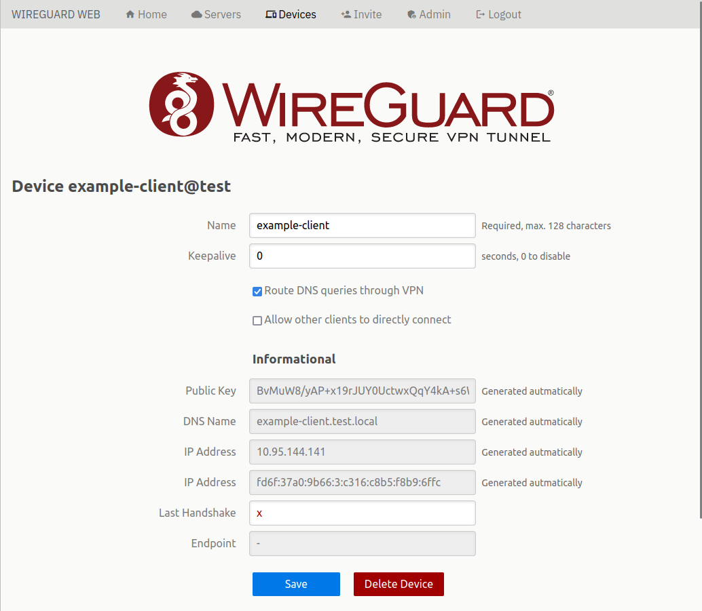
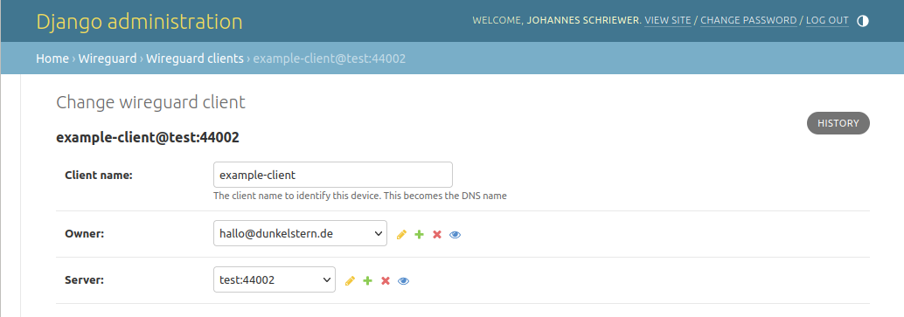
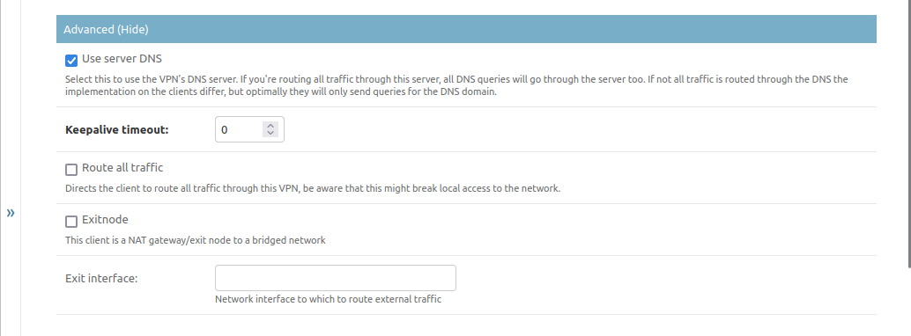
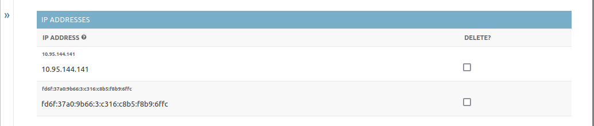
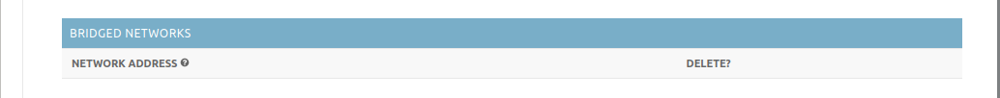
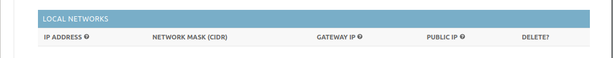

.. index:: client, device

********************
Client configuration
********************

.. contents::
   :depth: 3
   :local:

.. toctree::
   :maxdepth: 3

   p2p.rst

Introduction
============

Setting up clients may be done from the Web UI as normal Users would do, or
alternatively through the Django administration backend.

Client configuration looks like this on the Web UI, but to describe the settings
we're using the Django UI.

.. index:: client-name, owner, server

Basics
======

Basic settings for a client are rather simple. You basically need a *Name* which
will be used for UI and DNS purposes (name will be automatically simplified for
DNS usage), an owner and a server/endpoint to which to connect the client to.

.. index:: advanced, client, device

Advanced
========

The advanced settings are all visible at all times on the Django backend but
will be visible to the users on the UI only if the server has the corresponding
feature enabled.

.. index:: dns

Using VPN DNS services
----------------------

Enable *Use server DNS* to create a configuration file that sets a DNS server.

It depends on the operating system and the configuration method on when that
server is actually contacted. In worst case all DNS queries will go through the
VPNs DNS server which will cascade queries it can not answer to the server's
DNS, so make sure the server's DNS is able to answer DNS queries for the
Internet.

.. index:: keepalive, timeout, connection-tracking, nat

Keepalive Timeouts
------------------

Set the *Keepalive Timeout* when you have to be able to connect to this client
from other clients at all times. If the client is behind a NAT it is possible
that the router doing the NAT has a connection tracking timeout. If no data is
sent in that timeout the automatic port forwarding will be closed down and you
will not be able to connect to the client from anywhere. Usually the lowest
timeout a router has configured is about 30 seconds, so set this to 25 seconds
if you have problems reaching the client after it has been idle for some time.

Be aware that this will keep the client from going into any power saving modes,
so best use this only for clients that do not run on batteries.

.. index:: full-vpn, all traffic

Routing all traffic
-------------------

Enable *Route all traffic* if you want the client to send all network traffic
through this VPN endpoint. Be aware that this might break local network
communication, as well as DNS when no further configuration is done on the
client and VPN DNS is disabled.

.. index:: exit-node, bridge, bridged-network

Exitnodes
---------

This is basically the same setting as on the server side. On the Web UI this
setting will only be displayed to Staff or Admin users, as well as the
*Bridged Networks*-Setting below.

If you want to allow clients to access other networks over this client you might
want to enable *Exitnode* functionality. This is used by the bridging feature
of the VPN. This will enable NAT on the client for it to be able to bridge
incoming traffic through it's own network.

If you enable the *Exitnode* function, you must tell the client to which network
interface to route packets that cannot be routed locally. It is possible to
"stack" networks this way, but be aware what you're doing.

.. index:: ip-address, address, ip

IP Addresses
============

This only displays the IP addresses the service set for your clients
automatically, based on the endpoint configuration. If you want to you can
delete single addresses (for example if the client can not handle IPv6). If
you remove all addresses here and save the client, the service will re-generate
the assigned IPs automatically.

.. index:: bridge, bridged-network

Bridged Networks
================

This is only enabled when the server allows client bridges. When it does allow
bridges this works the same as the server variant. The IP is the IP of the
client in the network and other clients get routes to that network.

Be aware that other clients need to re-download their configuration when
something is changed here!

.. index:: local, peering, p2p

Local Networks
==============

This displays local network information if the client is using the peering
client for local peer2peer autoconfiguration.
